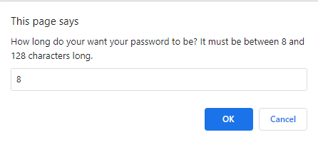
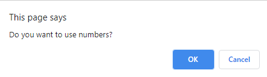
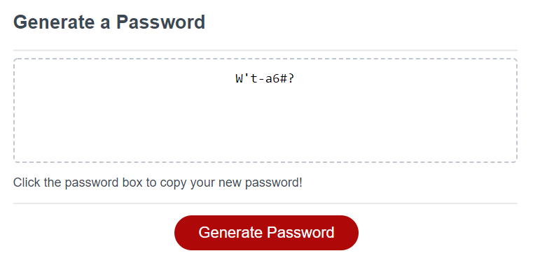

# Secure-Password-Generator
## Description
This project aims to create an application using Javascript for generating a secure password string given specified criteria. It will be capable of generating passwords with:
- 8-128 characters
- Mixed case alphabetic characters
- Numeric characters
- Special characters

The application allows you to copy the generated text by clicking the textbox it appears in.

## Usage
When you click the button, it will prompt you for the criteria of the password you want to generate: first with a prompt to input how long the password should be with an acceptable range of 8-128 characters. 8 is the default value.

After validating to make sure the user entered a number within range, user will then be presented a series of confirms to determine what characters to use in generating the password.

After making sure that the user has chosen at least one set of characters to generate from, the application will generate a random string of the chosen characters to the given length and will display the results in the textbox on the page.

Once a password has been generated for the first time, text will also appear to indicate that clicking on the textbox will copy the generated text to your clipboard for easy use.

## Credit
The HTML, CSS and Javascript at the current stage were derived from code provided by Trilogy Education Services, LLC, a 2U, Inc. brand.